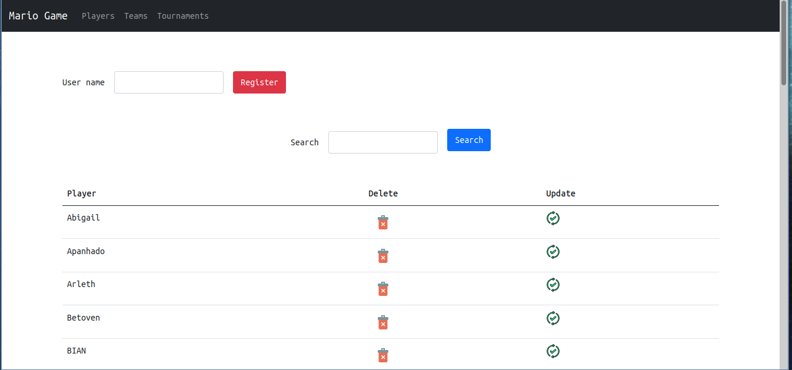
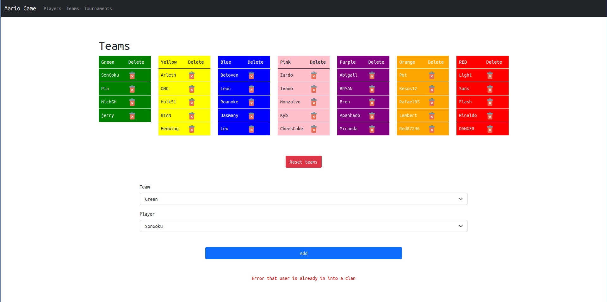
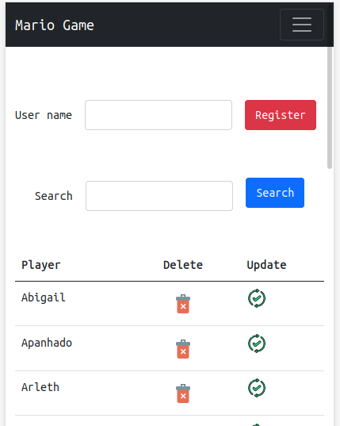

# MarioAdminGame
A system to administer and see the result of the games
## Run Local
### Libraries
pip install flask
pip install pymysql
### Database
Install mariadb
Run the file base.sql
### Setting
In the file db.py set your user and password of mariadb
### Screenshots

